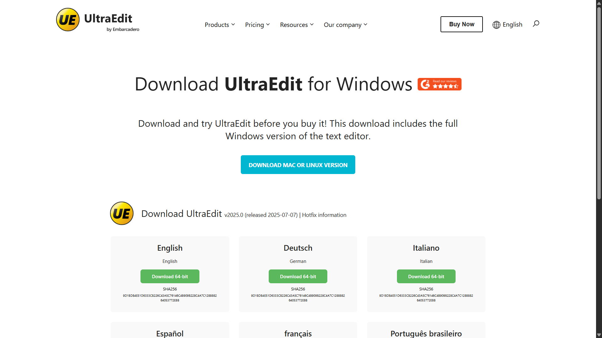

# UltaraaEdt-ui Clone (HTML & CSS)

A simple **UltaraaEdt landing page clone** built using **HTML** and **CSS**.  
⚠️ This project is **for learning purposes only** – not affiliated with UltraEdit.

---

## 🚀 Live Demo  
🔗 [View Project](https://ultaraa-edt-ui-clone.vercel.app/)

---

## 📸 Preview  


---

## ✨ Features  
- Navigation bar similar to Ultaraa-Edt  
- Hero section with title & description  
- Language selection section  
- Download buttons with hover effects  
- Responsive layout (works on desktop & mobile)  

---

## 🛠️ Tech Stack  
- **HTML5**  
- **CSS3** (Flexbox & Grid)

## 📂 How to Run  

1. Clone the repository:
   ```bash
   git clone https://github.com/shahidx05/UltaraaEdt-Clone
