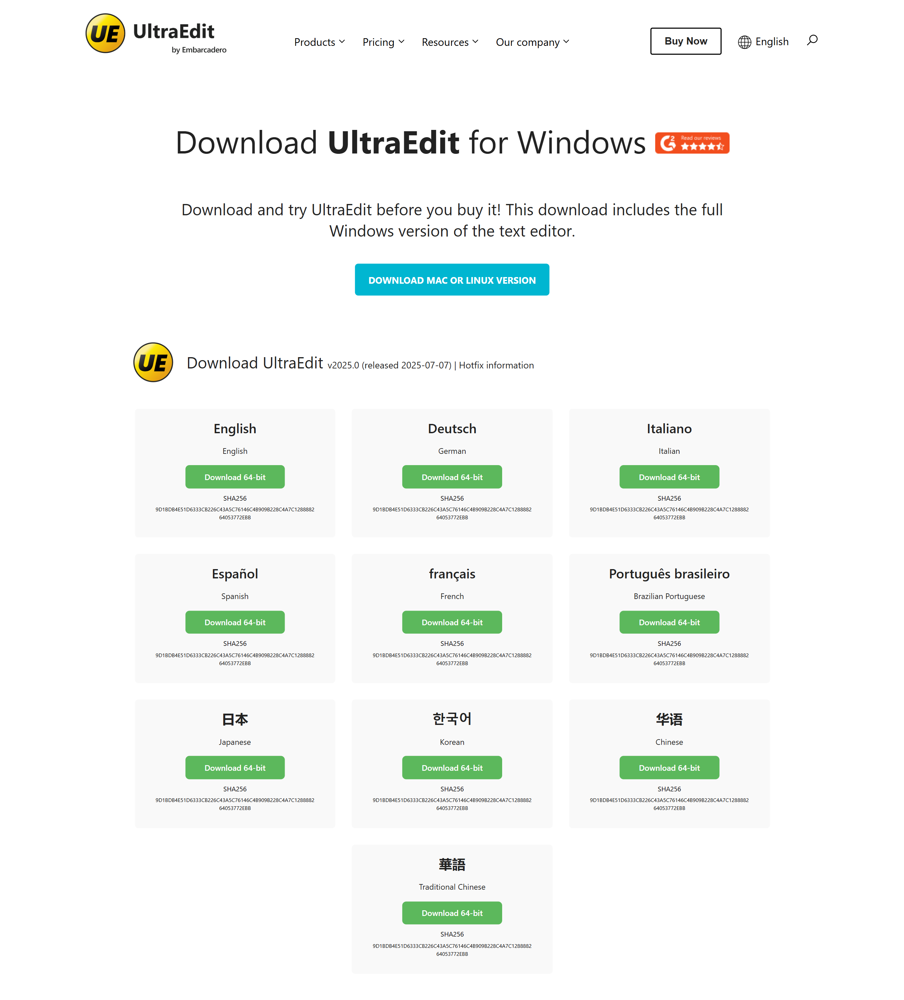

# UltraEdit Landing Page Clone

A responsive clone of the UltraEdit text editor's landing page, built using only **HTML** and **CSS**.

⚠️ **Disclaimer:** This project was created for educational purposes and to practice front-end development skills. It is not affiliated with UltraEdit in any way.

---

## 🚀 Live Demo

🔗 **[View Live Project](https://ultaraa-edt-ui-clone.vercel.app/)**

---

## 📸 Preview



---

## ✨ Features

* **Responsive Navigation:** A clean navigation bar that adapts to both desktop and mobile viewports.
* **Hero Section:** A faithful recreation of the main hero section with titles, descriptions, and calls-to-action.
* **Language Grid:** A grid layout showcasing the various languages supported.
* **Interactive Buttons:** Download buttons and links with proper hover effects.
* **Pure HTML/CSS:** Built without any frameworks or libraries to focus on core web technologies.
* **Responsive Layout:** The entire page is designed to be fully responsive.

---

## 🛠️ Tech Stack


---

## 🧠 Learning Objectives

The primary goal of this project was to:
* Practice creating complex layouts with **CSS Flexbox** and **CSS Grid**.
* Solidify understanding of **semantic HTML** structure.
* Implement **responsive design** principles using media queries.
* Replicate a professional, real-world website design from scratch.

---

## 📂 How to Run Locally

To get a local copy up and running, follow these simple steps.

1.  **Clone the repository:**
    ```bash
    git clone https://github.com/shahidx05/UltaraaEdt-Clone
    ```
2.  **Navigate to the project directory:**
    ```bash
    cd UltaraaEdt-Clone
    ```
3.  **Open the `index.html` file in your browser:**
    You can do this by double-clicking the file or by using a live server extension in your code editor (like "Live Server" for VS Code).